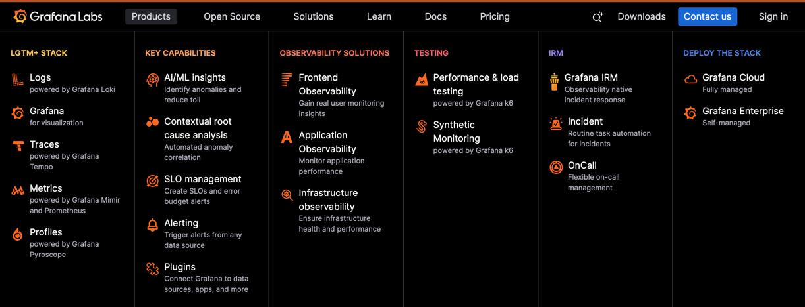

# Darien Technology Technical Test
## Despliegue de OpenWebUI + Ollama con Modelo LLM Local

## Parte 2

Imagina que la solución OpenWebUI + Ollama ha sido un éxito y la empresa ha decidido convertirla en una plataforma SaaS (Software as a Service) para múltiples clientes empresariales. La demanda ha crecido exponencialmente y el entorno de un solo servidor ya no es suficiente. Tu tarea es diseñar la arquitectura para esta nueva fase del producto. No debes implementar esta solución, solo diseñarla. El objetivo es evaluar tu capacidad para planificar una infraestructura robusta, escalable, segura y costo-eficiente en un entorno de nube real.

**Premisa**

La plataforma debe servir a cientos de clientes concurrentes, cada uno con sus propios
usuarios. Se debe garantizar el aislamiento de datos entre clientes y ofrecer diferentes
niveles de servicio (tiers) basados en el tipo de modelo LLM utilizado.

### Nuevos Requerimientos para el Diseño de Arquitectura

### 1. Alta Disponibilidad y Escalabilidad Regional:

#### 1.1. La infraestructura debe estar desplegada en un proveedor de nube principal. Justificar la elección.

Se utilizara AWS por su presencia lider en el mercado Cloud, su robusta presencia global y el gran catalogo de servicios que ofrece. Utilizaremos Amazon EKS, el cual es el servicio administrado de AWS para Kubernetes que delega la administracion del Control Plane a AWS y nos da la capacidad de integrarnos con el catalogo de servicios que posee AWS.

#### 1.2. Debe ser resiliente a la falla de una zona de disponibilidad completa (Multi-AZ).

La mayoria de los clientes estaran en America del Norte o LATAM y se ha decidido que por dar menos latencia la region de us-east-1 (N.Virginia) es la mejor opcion para poner la infraestructura (Basado en tests con herramientas como https://aws-latency-test.com en los paises donde estan nuestros clientes)

**us-east-1** posee 6 Availability Zones que nos permitira configurar nuestro cluster EKS y servicios adicionales con alta disponibilidad en caso que una AZ no funcione el trafico y computo pueda funcionar en otra. Ejemplo los nodos se distribuirian entre 3 AZs como minimo (Por medio de EC2 Auto Scaling), el Ingress por medio de Elastic Load Balancer tendrian configurado tres subnets en tres diferentes AZs, RDS, EFS y mas servicios serian configurados de la misma manera.

#### 1.3. Debe poder escalar horizontalmente tanto los nodos del clúster como las aplicaciones (OpenWebUI y Ollama) en función de la demanda.

Para escalar basado en la demanda se tiene:

- Nodos: Se usara Karpenter (https://karpenter.sh) para el aprovisionamiento de nodos basado en la demanda. 
- Aplicaciones en Kubernetes: Configuramos Horizontal Pod Autoscaler (HPA) para que escale horizontalmente los Pods basado en metricas de consumo. Ejemplo para Ollama crear mas pods si la metrica de memoria pasa un umbral.

### 2. Gestión de Modelos Múltiples y Aceleración por GPU:

#### 2.1. La plataforma ofrecerá dos tipos de modelos:
#### -- Modelos Rápidos (Tier Estándar): Varios modelos pequeños (ej.Llama3-8B, Mistral-7B) que pueden ejecutarse en instancias de CPU.
#### -- Modelos Potentes (Tier Premium): Un modelo grande (ej. Llama3-70B) que requiere obligatoriamente aceleración por GPU.

Se divide el cluster en dos NodeGroups para poner los Pods de Ollama:
1. NodeGroup Estandar: Se tendra un pool de Instancias M y C. Se podria optar por R, X y Z pequeñas si se desea algo mas de memoria.
2. NodeGroup Premium: Se tendra un poll de instancias G o P si el presupuesto lo permite.

#### 2.2. Debes diseñar cómo el clúster de Kubernetes gestionará nodos de propósito general (CPU) y nodos especializados con GPU. Explica cómo te asegurarías de que los pods de Ollama para el modelo grande se ejecuten exclusivamente en los nodos con GPU.

Se usaria una combinacion de Taints, Tolerations, Affinity y NodeSelectors para que el Scheduler asigne los pods a los nodos correspondientes. 

En los NodeGroup Estandar y Premiums se especifica los taints, por ejemplo:
- NodeGroup Estandar: tier: estandar
- NodeGroup Premium: tier: premium

Se divide el deployment de Ollama en dos:
- Deployment Estandar: Se especifica con NodeSelector el NodeGroup Estandar, Toleration para tier: Estandar y Affinity al Node Group Estandar.
- Deployment Premium: Se especifica con NodeSelector el NodeGroup Premium, Toleration para tier: Premium y Affinity al Node Group Premium.

Se tendra dos Services para conectara a cada Tier.

Por medio de OpenWebUI se gestionara el usuario y su permisologia que dice si tiene acceso a planes Premium o solo Estandar. Al seleccionar desde el UI el modelo, OpenWebUI conecta al Servicio que tiene los Pods del Tier y le permitira hacer las consultas en el Modelo correspondiente.

### 3. Optimización de Costos:

#### 3.1. Dado que las instancias de GPU son costosas, tu diseño debe incluir una estrategia para minimizar costos. Considera el uso de Instancias Spot/Preemptibles para las cargas de trabajo de GPU.

Se utilizara AWS Budgets y AWS Cost Explorer para monitorear activamente los costos que incurra el sistema. Cada semana/mes se analizaria los costos junto a las metricas de consumo para identificar oportunidades de optimizacion.

Karpenter administraria que tipo de instancias desplegar para que tipo de aplicacion/tier. Se configuraria para que el Tier Premium utilice Spot Instances.

#### 3.2. Explica cómo gestionarías la posible interrupción de estas instancias para no afectar el servicio al cliente (o para minimizar el impacto).

Karpenter estara monitoreando los nodos y si uno falla lo reemplazaria con un nuevo nodo. Se configuraria mensajes de aviso para que el cliente este anuente de que hay una falla en el sistema.

#### 3.3. El grupo de nodos de GPU debería poder escalar a cero si no hay solicitudes para el modelo Premium durante un período determinado.

Karpenter tiene la capacidad de escalar a zero si no hay trafico. Karpenter estima un tiempo de aproximadamente 90 segundos para desplegar un nuevo nodo. Dependiendo del tiempo de despliegue de los nuevos pods, se muestra al cliente un aviso que tiene que esperar con un contador.

Basado en data historica se puede configurar patrones de escalado y/o un solo nodo de menor tamaño para que el cliente no tenga tiempo de espera.

### 4. Arquitectura de Datos Robusta y Persistente:

#### 4.1. La base de datos ya no puede ser un simple pod en el clúster. Diseña el uso de un servicio de base de datos gestionado. Justifica la elección.

AWS ofrece el servicio Amazon Relational Database (RDS). Aurora es un tipo de RDS que ofrece alta disponibilidad, escalabilidad y rendimiento, operacion simplificada y seguridad.

- Alta disponibilidad: Aurora replica automáticamente los datos en tres AZ distintas dentro de la región (seis copias en su almacenamiento distribuido). Esto significa que la falla de una AZ o incluso de un nodo de base de datos no provoca pérdida de servicio, pues hay instancias en standby listas para failover. RDS Multi-AZ, por su parte, mantiene una réplica sincronizada en otra AZ para failover automático.
- Escalabilidad y rendimiento: Aurora ofrece autoescalado de capacidad (Aurora Serverless v2) y puede añadir réplicas de solo lectura fácilmente para repartir carga de consultas. Garantiza throughput alto y latencias bajas incluso con picos de usuarios. Está optimizado para manejar miles de conexiones concurrentes, ideal para SaaS multi-cliente.
- Operación simplificada: Al ser un servicio gestionado, AWS se encarga de parches, actualizaciones de versión, backups automáticos y encryption at rest, liberando al equipo de DevOps de esa carga. También integra monitoreo (CloudWatch) para performance insights. En comparación, una base de datos auto-alojada en Kubernetes sería más propensa a fallos (pod expulsado, pérdida de datos si PVC no replicado) y requeriría implementar manualmente HA y backups.
- Seguridad: Aurora/RDS permite aislarse en subredes privadas (sin acceso público), controlar acceso vía Security Groups e integrar con AWS IAM para autenticación. Además, todos los datos en reposo y en tránsito pueden cifrarse fácilmente. En multi-inquilino, podemos usar un solo esquema multi-tenant o múltiples esquemas/DB por cliente, según convenga, sabiendo que la base de datos es confiable y consistente.

RDS alojaria los chats, configuraciones, metadata y mas. Para incrementar la velocidad de la aplicacion se puede agregar Redis (Elasticache) para cachear respuestas mas frecuentes.

#### 4.2. Los modelos LLM son pesados. Descargarlos cada vez que un nuevo pod de Ollama se inicia es ineficiente. Propón una solución para almacenar los modelos de forma centralizada y persistente, de manera que los nodos puedan acceder a ellos rápidamente al escalar.

Para centralizar el alojamiento de los Modelos se usara AWS Elastic File System (EFS), un servicio AWS de archivos en red administrado. Es Multi-AZ y se puede montar en varios nodos a la vez. Los volumenes creados por Kubernetes se respaldaran en EFS y los deployments de Ollana montaran este volumen a cada Pod.

Cuando se implemente un nuevo modelo el pod lo bajara y almacenara en EFS, asi en el futuro cuando se use el modelo ya los Pods lo encontraran en EFS y sera mas rapida su carga.

### 5. Seguridad y Gobernanza Multi-Inquilino (Multi-Tenant):

#### 5.1. Diseña cómo usarías los Namespaces de Kubernetes para aislar los recursos de diferentes clientes o entornos.
Para aislar a cada cliente se utilizaria un Namespace por cliente. Cada Namespace tendria OpenWebUI y Ollama.

Ejemplo:
1. Cliente1
2. Cliente2
3. Cliente3

#### 5.2. Explica cómo implementarías Políticas de Red (Network Policies) para controlar el tráfico entre los pods de OpenWebUI y Ollama, y para aislar a los inquilinos.

- Se usara un DENY ALL entre namespaces.
- Dentro de cada namespace se especifica que los pods de OpenWebUI solo pueden hablar con Ollama y la capa de data (RDS, EFS, Cache).
- Los pods de Ollama solo pueden hablar con OpenWebUI.
- Politica especial para bajar nuevos Modelos.

#### 5.3. La gestión de secretos ya no puede ser una elección libre. Debes integrar un servicio de gestión de secretos centralizado y seguro.

AWS cuenta con un servicio de manejo de secretos llamado AWS Secrets Manager. Este servicio almacena secretos cifrados y permite rotacion automatica. Se puede integrar con EKS mediante el External Secrets Operator o el AWS Secrets CSI driver para que los pods obtengan los secretos que necesitan de Secrets Manager. Cada secreto puede estar etiquetado por cliente/entorno, y los IAM roles asociados a pods en un namespace solo tendran permiso de leer los secretos pertenecientes a ese cliente. Por ejemplo, la conexion de la base de datos del Cliente1 reside cifrada en Secrets Manager y es montada como un volumen o inyectada como variable de entorno unicamente en los pods del namespace del Cliente1.

### 6. Observabilidad Avanzada:
#### 6.1. Propón una pila de observabilidad más completa para producción. Explica brevemente cómo se integrarían estos componentes.

Ampliaria el stack actual de Prometheus, Grafana, Loki y Alermanager al mejorar las reglas, metricas y dashboard que se tienen actualmente.

Añadiria Tempo para ver las trazas del sistema y Performance, Load Testing y Synthetic Monitoring con k6. 

Se tendria:

1. Grafana: Para mostrar dashboards y widgets que nos den de una manera amigable la informacion recopilada por los demas componentes del stack.
2. Prometheus: Recibe las metricas e informacion del cluster.
3. Alermanager: Alerta de cualquier incoveniente.
4. Loki: Recibe y gestiona los logs del sistema.
5. Tempo: Da mas visibilidad en el comportamiento de la aplicacion para su troubleshooting.
6. k6: Para hacer pruebas de performnace, load y monitoreo sintetico para ver la disponibilidad del sistema.

Grafana ofrece un conjunto de productos robusto para el monitoreo de Kubernetes:

Posee buena integracion con Kubernetes https://grafana.com/solutions/kubernetes/
1. Es facil de desplegar.
2. Permite el manejo de costos.
3. Da visibilidad a los issues del sistema.
4. Completa visibilidad del Cluster de Kubernetes.
5. Nos da la capacidad de optimizar, analizar y anticipar el uso de recursos (Capacity planning).
6. Visibilidad al uso de network y performance.
7. Manejo de logs, trazas y mas.

Dependiendo de presupuesto se puede usar el servicio Grafana Cloud o hostearlo en el cluster.