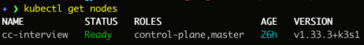
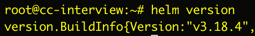

# Darien Technology Technical Test
## Despliegue de OpenWebUI + Ollama con Modelo LLM Local

## Parte 1

Se debe desplegar una instancia de OpenWebUI conectada a Ollama para ejecutar un modelo LLM local (e.g., Llama3, Qwen, Mistral) con alta disponibilidad, seguridad, manejo  de secretos y monitoreo. La aplicación debe ser accesible mediante el dominio que se definirá posteriormente (ya configurado por el equipo) y utilizar una base de datos.

### Especificaciones Tecnicas

Servidor Ubuntu 24.04 LTS

**Hardware:**
- vCPU: 4
- RAM: 8 GB

**Dominios:**
- OpenWebUI: devops-cc.darienc.com para 
- Monitoreo: devops-monitor-cc.darienc.com

**Repositorio:**
- https://github.com/chriscogley/Darien-Technology-Test

### El Servicio debe tener:

1. Componentes principales: OpenWebUI, Ollama y Base de Datos.
2. Kubernetes.
3. Monitoreo.
4. Seguridad.
5. Despliegue.

## Implementacion

Por las especificaciones del servidor se usa k3s (distribucion de Kubernetes ligera) para correr Kubernetes.


Utilizando un solo nodo:



Para implementar los componentes principales se lo siguiente:

### Helm



Package Manager para Kubernetes. Utilizado para instalar Cert Manager (Manejo de certificados SSL), Stack de monitoreo (Grafana, Prometheus y sus reglas y dashboards), OpenWebUI, Ollama y Postgresql.

Se utilizo debido a la facilidad que da para desplegar aplicaciones.

### ArgoCD


### GitHub

Plataforma de hosting de repositorios Git. El codigo que declara los recursos y elementos para crear los componentes principales que hacen funcionar el sistema se encuentra versionado y guardado en este repositorio: https://github.com/chriscogley/Darien-Technology-Test

La estructura principal del repositorio es la siguiente:

```
.
├── apps
├── bootstrap
├── charts
├── manifests
├── Part 2
├── README.md
├── scripts

```
### Folder apps

Las aplicaciones de ArgoCD. Objetos que usa ArgoCD para instalar cada uno de los componentes necesarios del sistema.

1. 00-namespaces.yaml: Crea los namespaces ai (para poner los recursos usados para la parte de AI) y monitoring (para poner los recursos del stack de observabilidad). Se crean de primero para que los recursos creados tengan un lugar donde ser creados.
2. app-secrets.yaml: Aplica los secretos en el cluster.
3. argocd-ui.yaml: Crea el ingress para ver la UI de ArgoCD.
4. blackbox-exporter.yaml: Usado por el stack de observabilidad para monitorear Ollama.
5. cert-manager.yaml: Instala cert-manager para manejar y aplicar los certificados SSL dados por Let's Encrypt.
6. cluster-issuer.yaml: Aplica el Let's Encrypt ClusterIssuer, aplica los certs.
7. kube-prometheus-stack.yaml: Maneja parte del stack de observabilidad que maneja Dashboards y Metricas/Alertas (Grafana y Prometheus). Instala Prometheus, Grafana y Alertmanager.
8. loki.yaml: Maneja parte del stack de observabilidad que maneja Logs (Loki).
9. monitoring-config.yaml: Configuraciones del stack de observabilidad. Aplica el dashboar de Grafana, reglas de Prometheus y colectores.
10. ollama.yaml: Crea ollama en Kubernetes, usado para correr los LLM. Se usa el modelo llama3.2:1b debido a que no consume tantos recursos. Corre 2 replicas.
11. openwebui.yaml: Interfaz web para interactuar con el LLM de Ollama.
12. postgresql.yaml: Para guardar la informacion de OpenWebUI en la base de datos Postgresql.
13. prometheus-operator-crds.yaml: Configuraciones del stack de observabilidad. Instala los CRD de prometheus por separado para que el stack principal pueda renderear bien.
14. promtail.yaml: Configuraciones del stack de observabilidad. Instala Promtail para enviar los logs de los pods a Loki.
15. sealed-secrets.yaml: Instala el SealedSecrets controller, usado para encriptar los secretos usados en el sistema.

### Folder bootstrap

Punto principal que usa ArgoCD para desplegar todas las apps. Se corre una vez y ArgoCD toma el control de manejar los cambios.

### Folder charts

Chart Helm para instalar OpenWebUI.

### Folder manifests

YAMLs simples de Kubernetes (no Helms) para instalar:
1. El ingress de ArgoCD UI creado para acceder desde mi explorador web. Use un dominio propio para poder acceder al ArgoCD UI y ver mas facil lo que sucede en el ArgoCD.
2. El cluster issuer usado por los ingress para generar los certs de Let's Encrypt. Todo ingress creado obtiene su cert SSl.
3. Las reglas de prometheus, dashboard de grafana y colectores del stack de observabilidad. Separado para claridad.
4. Secretos encriptados para aplicar en el Cluster. Forma sencilla y rapida de aplicar los secretos de una manera segura.

### Folder scripts

Script usado para encriptar (usando kubeseal) los secretos y ponerlos en manifests/secrets/

## Workflow:

1. Se hace commit de los manifests/Helm charts de Kubernetes al repositorio Git.
2. ArgoCD detecta cambios en el respositorio.
3. ArgoCD automaticamente aplica los cambios en el cluster.
4. ArgoCD monitorea la salud de la aplicacion y el status de la sincronizacion.


## README explicativo (en el repositorio) sobre las decisiones tomadas y que evidencien las configuraciones.

