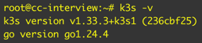

# Darien Technology Technical Test
## Despliegue de OpenWebUI + Ollama con Modelo LLM Local

[!IMPORTANT]
Los entregables de la Parte 1 estan en la raiz del repositorio. Los entregables de la Parte 2 estan en el folder Part 2/


## Parte 1

Se debe desplegar una instancia de OpenWebUI conectada a Ollama para ejecutar un modelo LLM local (e.g., Llama3, Qwen, Mistral) con alta disponibilidad, seguridad, manejo  de secretos y monitoreo. La aplicación debe ser accesible mediante el dominio que se definirá posteriormente (ya configurado por el equipo) y utilizar una base de datos.

### Especificaciones Tecnicas

Servidor Ubuntu 24.04 LTS

**Hardware:**
- vCPU: 4
- RAM: 8 GB

**Dominios:**
- OpenWebUI: devops-cc.darienc.com para 
- Monitoreo: devops-monitor-cc.darienc.com

**Repositorio:**
- https://github.com/chriscogley/Darien-Technology-Test

### El Servicio debe tener:

1. Componentes principales: OpenWebUI, Ollama y Base de Datos.
2. Kubernetes.
3. Monitoreo.
4. Seguridad.
5. Despliegue.

## Implementacion


## 1. Componentes Principales

En el Namespace AI se instalo los componentes Kubernetes (pods, service, deployment, replicaset, statefulset) para correr los componentes principales que hacen correr la aplicacion solicitada:

OpenWebUI, Ollama y Postgresql

Se accede por medio de https://devops-cc.darienc.com a OpenWebUI


Se accede con los credenciales:
- Username: chriscogley@gmail.com

Nota: En mis investigaciones no pude encontrar como logear solo con el username admin, el login solicita email:

- Password: (El indicado en los Entregables)


Se usa el modelo llama3.2:1b porque es un modelo liviano que no consume tanta memoria. Modelos como llama3-8b me arrojaban errores de memoria debido al tamaño que piden:


Se guarda el historial de chats:


**Los archivos que manejan la parte de Componentes principales son:**

1. ollama.yaml: Crea ollama en Kubernetes, usado para correr los LLM. Se usa el modelo llama3.2:1b debido a que no consume tantos recursos. Corre 2 replicas.
2. openwebui.yaml: Interfaz web para interactuar con el LLM de Ollama.
3. postgresql.yaml: Para guardar la informacion de OpenWebUI en la base de datos Postgresql.

## 2. Kubernetes

Por las especificaciones del servidor se usa k3s (distribucion de Kubernetes ligera) para correr Kubernetes.



Utilizando un solo nodo:


Para implementar los componentes principales se lo siguiente:

### Helm


Package Manager para Kubernetes. Utilizado para instalar Cert Manager (Manejo de certificados SSL), Stack de monitoreo (Grafana, Prometheus y sus reglas y dashboards), OpenWebUI, Ollama y Postgresql.

Se utilizo debido a la facilidad que da para desplegar aplicaciones.

### Recursos creados:

#### Controllers

1. Traefik ingress: Para el ingress a las aplicaciones.
2. Sealed Secrets: Para encriptar los secrets que usa el cluster.
3. ArgoCD: Para el CD de cambios en el cluster.
4. Cert Manager: Para el manejo de certificados SSL.

#### Namespace AI 

Donde esta OpenWebUI, Ollama y Postgresql


#### Namespace Monitoring

Donde esta el stack de observabilidad Grafana, Prometheus, AlertManager, Loki.


**Los archivos que manejan la parte de Kubernetes son:**

1. 00-namespaces.yaml: Crea los namespaces ai (para poner los recursos usados para la parte de AI) y monitoring (para poner los recursos del stack de observabilidad). Se crean de primero para que los recursos creados tengan un lugar donde ser creados.
2. ollama.yaml: Crea ollama en Kubernetes, usado para correr los LLM. Se usa el modelo llama3.2:1b debido a que no consume tantos recursos. Corre 2 replicas.
3. openwebui.yaml: Interfaz web para interactuar con el LLM de Ollama.
4. postgresql.yaml: Para guardar la informacion de OpenWebUI en la base de datos Postgresql.
5. charts/*

## 3. Monitoreo

Se instalo un stack de:
1. Grafana: Para mostrar dashboards con graficas y widgets.
2. Prometheus: Para el manejo de metricas.
3. AlertManager: Para el manejo de alertas.
4. Loki: Para la gestion de Logs.


Acceso publico como se indica en los entregables.

Se creo el Dashboard OpenWebUI + Ollama Overview para mostrar las metricas solicitadas:
https://devops-monitor-cc.darienc.com/goto/GedrbQlNR?orgId=1

Y una alerta para la RAM de Ollama:


**Los archivos que manejan la parte de Monitoreo son:**

1. blackbox-exporter.yaml: Usado por el stack de observabilidad para monitorear Ollama. 
2. kube-prometheus-stack.yaml: Maneja parte del stack de observabilidad que maneja Dashboards y Metricas/Alertas (Grafana y Prometheus). Instala Prometheus, Grafana y Alertmanager.
3. loki.yaml: Maneja parte del stack de observabilidad que maneja Logs (Loki). 
4. monitoring-config.yaml: Configuraciones del stack de observabilidad. Aplica el dashboar de Grafana, reglas de Prometheus y colectores.
5. prometheus-operator-crds.yaml: Configuraciones del stack de observabilidad. Instala los CRD de prometheus por separado para que el stack principal pueda renderear bien.
6. promtail.yaml: Configuraciones del stack de observabilidad. Instala Promtail para enviar los logs de los pods a Loki.
7. manifests/monitoring/*

## 4. Seguridad

### 4.1 Seguridad - Certificados SSL

Se utiliza Cert Manager para manejar y aprovisionar con Let's Encrypt (validacion HTTP-01 por port 80) los certificados SSL utilizados por todo Ingress que se cree en el cluster (Cluster Issuer). Se usa Let's Encrypt porque es gratis y ya tiene integraciones con Kubernetes.

Los dominios https://devops-cc.darienc.com/ y https://devops-monitor-cc.darienc.com/ poseen certificados SSL validos:


**Los archivos que manejan la parte de Seguridad/Certificados SSL son:**

4. cert-manager.yaml: Instala cert-manager para manejar y aplicar los certificados SSL dados por Let's Encrypt.
5. cluster-issuer.yaml: Aplica el Let's Encrypt ClusterIssuer, aplica los certs.

### 4.2 Secretos

Para reducir la complejidad y tiempo de implementacion se usa SealedSecrets para encriptar los credenciales usados por el cluster (ej: la base de datos). Utilizando kubeseal (Script en el folder scripts/seal.sh) se encripta los credenciales usando el cert del cluster Kubernetes y se pone en manifests/secrets/* en YAMLs que importaran la configuracion a OpenWebUI y Postgresql
```
spec:
  encryptedData:
```
El cluster se encarga de desencriptar los secrets utilizando su certificado para poder usar los secrets. 

**Los archivos que manejan la parte de Seguridad/Manejo de Secretos son:**

1. app-secrets.yaml: Aplica los secretos en el cluster.
2. sealed-secrets.yaml: Instala el SealedSecrets controller, usado para encriptar los secretos usados en el sistema.
3. scripts/*

## 5. Despliegue

Se usa ArgoCD para el despliegue de las aplicaciones y GitHub como repositorio.

### ArgoCD


Se accede al UI por un dominio propio (https://argocd.chriscogley.com)


Dentro se encuentra de manera grafica las apps configuradas por medio de YAML


ArgoCD detecta si hay cambios en el repositorio GitHub (demora aprox 5 minutos, se puede mejorar) y hace un Sync de los cambios en el Cluster Kubernetes. 


Desde el UI se puede ver detalles de la App, la arquitectura de la app (que despliega, ej: Pods, Deployments, Services, etc), Status de la sincronizacion y Logs.

### GitHub

Plataforma de hosting de repositorios Git. El codigo que declara los recursos y elementos para crear los componentes principales que hacen funcionar el sistema se encuentra versionado y guardado en este repositorio: https://github.com/chriscogley/Darien-Technology-Test

La estructura principal del repositorio es la siguiente:

```
.
├── apps
├── bootstrap
├── charts
├── manifests
├── Part 2
├── README.md
├── scripts

```
#### Folder apps

Las aplicaciones de ArgoCD. Objetos que usa ArgoCD para instalar cada uno de los componentes necesarios del sistema.

1. 00-namespaces.yaml: Crea los namespaces ai (para poner los recursos usados para la parte de AI) y monitoring (para poner los recursos del stack de observabilidad). Se crean de primero para que los recursos creados tengan un lugar donde ser creados.
2. app-secrets.yaml: Aplica los secretos en el cluster.
3. argocd-ui.yaml: Crea el ingress para ver la UI de ArgoCD.
4. blackbox-exporter.yaml: Usado por el stack de observabilidad para monitorear Ollama.
5. cert-manager.yaml: Instala cert-manager para manejar y aplicar los certificados SSL dados por Let's Encrypt.
6. cluster-issuer.yaml: Aplica el Let's Encrypt ClusterIssuer, aplica los certs.
7. kube-prometheus-stack.yaml: Maneja parte del stack de observabilidad que maneja Dashboards y Metricas/Alertas (Grafana y Prometheus). Instala Prometheus, Grafana y Alertmanager.
8. loki.yaml: Maneja parte del stack de observabilidad que maneja Logs (Loki).
9. monitoring-config.yaml: Configuraciones del stack de observabilidad. Aplica el dashboar de Grafana, reglas de Prometheus y colectores.
10. ollama.yaml: Crea ollama en Kubernetes, usado para correr los LLM. Se usa el modelo llama3.2:1b debido a que no consume tantos recursos. Corre 2 replicas.
11. openwebui.yaml: Interfaz web para interactuar con el LLM de Ollama.
12. postgresql.yaml: Para guardar la informacion de OpenWebUI en la base de datos Postgresql.
13. prometheus-operator-crds.yaml: Configuraciones del stack de observabilidad. Instala los CRD de prometheus por separado para que el stack principal pueda renderear bien.
14. promtail.yaml: Configuraciones del stack de observabilidad. Instala Promtail para enviar los logs de los pods a Loki.
15. sealed-secrets.yaml: Instala el SealedSecrets controller, usado para encriptar los secretos usados en el sistema.

#### Folder bootstrap

Punto principal que usa ArgoCD para desplegar todas las apps. Se corre una vez y ArgoCD toma el control de manejar los cambios.

#### Folder charts

Chart Helm para instalar OpenWebUI. Usada una local para integrar secretos y envs para concetar al stack de observabilidad.

#### Folder manifests

YAMLs simples de Kubernetes (no Helms) para instalar:
1. El ingress de ArgoCD UI creado para acceder desde mi explorador web. Use un dominio propio para poder acceder al ArgoCD UI y ver mas facil lo que sucede en el ArgoCD.
2. El cluster issuer usado por los ingress para generar los certs de Let's Encrypt. Todo ingress creado obtiene su cert SSl.
3. Las reglas de prometheus, dashboard de grafana y colectores del stack de observabilidad. Separado para claridad.
4. Secretos encriptados para aplicar en el Cluster. Forma sencilla y rapida de aplicar los secretos de una manera segura.

#### Folder scripts

Script usado para encriptar (usando kubeseal) los secretos y ponerlos en manifests/secrets/

#### Workflow de despliegue:

1. Se hace commit de los manifests/Helm charts de Kubernetes al repositorio Git.
2. ArgoCD detecta cambios en el respositorio.
3. ArgoCD automaticamente aplica los cambios en el cluster.
4. ArgoCD monitorea la salud de la aplicacion y el status de la sincronizacion.

------------------------

